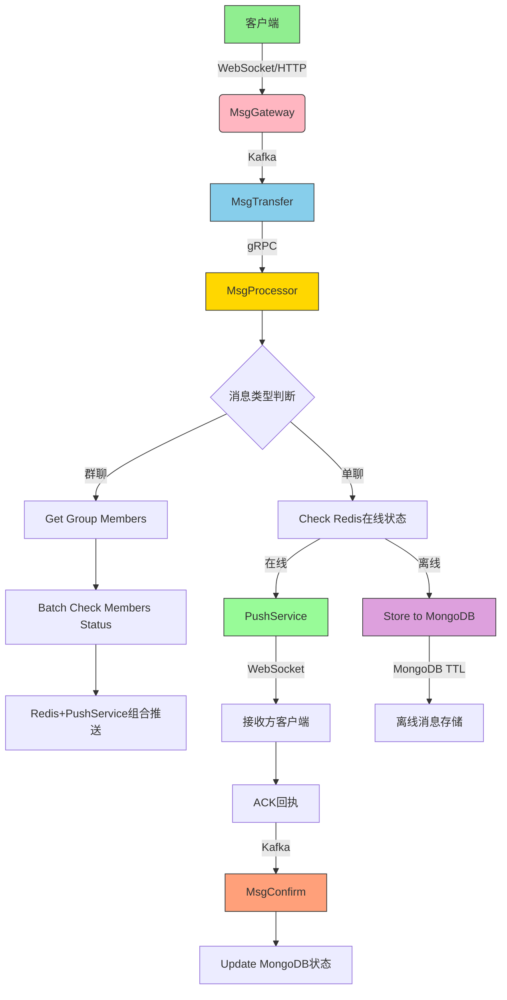

---
# 这是文章的标题
title: m

# 这是侧边栏的顺序
order: 2
# 设置作者
author: xiaoxie
# 设置写作时间
date: 2025-01-01

# 一个页面可以有多个标签
tag:
  - db

# 此页面会出现在星标文章中
star: true
---

> 职位描述中强调了Golang、Docker、IM系统开发经验，尤其是熟悉OpenIM。这些要求看似明确，但可能存在一些隐性的考察点

####  1.**表面问题 vs 实际考察点**

- **表面**："有IM系统开发经验"
- **陷阱**：验证是否真正理解IM核心机制（消息顺序性/离线推送/协议选型），而非仅仅调用过API
- **淘汰点**：仅提及"用过某某SDK"，但无法解释消息ACK机制或流量控制策略

#### 2. **技术栈深度验证**

- **表面**："熟悉Golang和Gin框架"
- **陷阱**：考察是否了解Gin的路由树实现原理、中间件执行顺序优化
- **淘汰点**：只能写CRUD代码，无法解释`gin.RouterGroup`的嵌套设计对性能的影响

#### 3. **创业公司适应性**

- **表面**："维护服务器运行"
- **陷阱**：验证是否具备全栈运维能力（从Docker部署到K8s故障排查）
- **淘汰点**：仅关注业务代码开发，对监控告警、成本优化无实践经验

#### 陷阱题1：**"请简述OpenIM的消息投递流程"**

- **考察点**：是否真正阅读过OpenIM源码或参与过二次开发

- **错误回答**："通过WebSocket发送消息，服务端存储到数据库"（过于笼统）

- 

  高分回答

  ：

  > "OpenIM的消息投递分为三级：
  >
  > 1. **客户端**：通过`ws_server`建立长连接，携带Seq序列号保证顺序
  > 2. **消息路由**：`msg_transfer`模块将消息写入Kafka分区（按ReceiverID哈希）
  > 3. **持久化**：`msg_callback`消费Kafka，批量写入MongoDB分片集群
  >    我们曾优化过`msg_transfer`的批量写入策略，将吞吐量从1.2万QPS提升到4.5万QPS"
  >    ​**技巧**：结合源码模块名称+性能优化数据

#### 陷阱题2：**"Golang如何管理10万条长连接？"**

- **考察点**：高并发场景下的资源控制能力

- **错误回答**："每个连接开一个Goroutine"（未考虑泄露风险）

- 

  高分回答

  ：

  > "我们采用分层管理策略：
  >
  > 1. **连接池**：使用`sync.Pool`复用TCP连接对象
  > 2. **协程控制**：通过`worker pool`限制并发Goroutine数（例如5000个/CPU核心）
  > 3. **心跳优化**：合并多个连接的保活包，减少系统调用次数
  >    实际压测中，单节点稳定维持12万连接，内存占用控制在4.8GB"
  >    ​**技巧**：给出量化指标+资源优化手段

#### 陷阱题3：**"如果用户反馈消息延迟高，如何排查？"**

- **考察点**：全链路故障定位能力

- **错误回答**："检查服务端代码"（缺乏系统性）

- 

  高分回答

  ：

  > "我们的排查路径是：
  >
  > 1. **客户端**：Wireshark抓包确认TCP重传率
  > 2. **网络层**：通过`mtr`工具分析链路抖动
  > 3. **服务端**：`pprof`分析Goroutine阻塞点，`sarama`监控Kafka消费延迟
  > 4. **存储层**：MongoDB执行`explain()`分析慢查询
  >    曾定位到Kafka消费者配置`fetch.min.bytes=1MB`导致批次处理延迟，调整后P99延迟下降65%"
  >    ​**技巧**：展现从端到端的排查能力+真实案例

------

### 三、陷阱题应答原则

