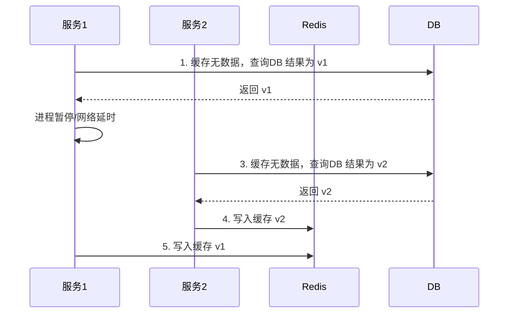

---
# 这是文章的标题
title: Redis


# 这是侧边栏的顺序
order: 4
# 设置作者
author: xiaoxie
# 设置写作时间
date: 2020-01-01

# 一个页面可以有多个标签
tag:
  - db

# 此页面会出现在星标文章中
star: true
---

# Redis理论


官方网站：https://redis.io/

中文网站：https://www.redis.net.cn/


## 01、Redis 简介


Redis 是完全开源免费的，遵守BSD协议，是一个高性能的`key-value`数据库。

Redis 特点：

- Redis支持数据的持久化，可以将内存中的数据保持在磁盘中，重启的时候可以再次加载进行使用。
- Redis不仅仅支持简单的key-value类型的数据，同时还提供list，set，zset，hash等数据结构的存储。
- Redis支持数据的备份，即master-slave模式的数据备份。


### Redis 优势

- 性能极高 – Redis能读的速度是110000次/s,写的速度是81000次/s 。
- 丰富的数据类型 – Redis支持二进制案例的 Strings, Lists, Hashes, Sets 及 Ordered Sets 数据类型操作。
- 原子 – Redis的所有操作都是原子性的，同时Redis还支持对几个操作全并后的原子性执行。
- 丰富的特性 – Redis还支持 publish/subscribe, 通知, key 过期等等特性。


### 为什么用redis

#### 高性能

- ==单线程简单、无线程开销==  使用单线程简单，避免了多线程的竞争；同时还省去了多线程切换带来的时间和性能上的开销。

- redis主要基于内存操作内存的执行效率本身就很快，并且redis还采用了高效的数据结构。

- 在请求上采用I\O多路复用机制多路复用机制是一种基于非阻塞I/O模型，可以使redis高效的进行网络通信，I/O的读写也不再阻塞，就可以处理大量的客户端socket请求。

#### 高并发

- mysql单机一般只能支撑到2000Qps，而redis由于是K/V式的操作，单机可以支撑并发量几万到十几万。

- redis分布式集群化扩展性极高，而且稳定，能够支撑大量的数据吞吐，只要硬件支持。

  

#### 与传统关系型数据库对比：

- redis 的优势比较多，如高性能，高可用，丰富的数据类型、原子性、扩展性比较强、可持久化、生态完善等等，但是比较有决定性的还是高性能和丰富的数据类型支持（string、list、set、sortedset（有序集合）、hash等），

- 一般一个东西好不好用，多数比较出来的，一般我们项目中引入redis 多数是为了减轻关系型数据库压力的，那就跟关系型数据库来比较，常见的关系型数据库是基于磁盘存储的，数据存取IO较高，


## 02、Redis的下载和安装


### 1.window下安装Redis服务


1. Github获取redis安装包，[地址：Redis](https://github.com/MSOpenTech/redis)
2. 双击点击安装msi格式的安装包，开始进行安装
3. 安装注意：添加redis目录到环境变量方便系统自动识别、使用默认端口、设置最大内存学习就100MB
4. 对Redis进行配置：
   1. 编辑器编辑redis.windows-service.conf文件
   2. 找到requirepass配置（设置密码），如：输入requirepass 12345。（测试环境可以不用密码）
   3. 确保服务正常启动即可
5. 可正常在命令行操作Redis了

```sh
输入命令：redis-cli     ---（客户端程序）
127.0.0.1:6379> 

输入密码回车：auth 12345 返回提示OK表示验证通过
127.0.0.1:6379> auth 12345
Ok    
```


### 2.Linux下安装Redis服务


1. 安装编译环境gcc （Redis是C编写的，需要C的环境）

   ```sh
   yum install gcc-c++
   ```

2. 下载，解压，编译（redis下载地址为：https://redis.io/download/）

   ```sh
   $ wget https://github.com/redis/redis/archive/7.0.8.tar.gz
   $ tar xzf 7.0.8.tar.gz
   $ cd redis-7.0.8
   $ make
   ```

3. 二进制文件是编译完成后在`src`目录下. 运行如下

   ```sh
   $ src/redis-server
   ```

4. 使用客户端连接服务

   ```sh
   # 本地连接
   $ src/redis-cli
   redis> 
   
   # 远程连接
   $ redis-cli -h host -p port -a password
   ```

   

### 3.Redis配置文件详解

- Redis 的配置文件位于 Redis 安装目录下，文件名为 redis.conf。
- 你可以通过 **CONFIG** 命令查看或设置配置项。

```sh
参数说明
redis.conf 配置项说明如下：

1. Redis默认不是以守护进程的方式运行，可以通过该配置项修改，使用yes启用守护进程
    daemonize no
2. 当Redis以守护进程方式运行时，Redis默认会把pid写入/var/run/redis.pid文件，可以通过pidfile指定
    pidfile /var/run/redis.pid
3. 指定Redis监听端口，默认端口为6379，作者在自己的一篇博文中解释了为什么选用6379作为默认端口，因为6379在手机按键上MERZ对应的号码，而MERZ取自意大利歌女Alessia Merz的名字
    port 6379
4. 绑定的主机地址
    bind 127.0.0.1
5.当 客户端闲置多长时间后关闭连接，如果指定为0，表示关闭该功能
    timeout 300
6. 指定日志记录级别，Redis总共支持四个级别：debug、verbose、notice、warning，默认为verbose
    loglevel verbose
7. 日志记录方式，默认为标准输出，如果配置Redis为守护进程方式运行，而这里又配置为日志记录方式为标准输出，则日志将会发送给/dev/null
    logfile stdout
8. 设置数据库的数量，默认数据库为0，可以使用SELECT <dbid>命令在连接上指定数据库id
    databases 16
9. 指定在多长时间内，有多少次更新操作，就将数据同步到数据文件，可以多个条件配合
    save <seconds> <changes>
    Redis默认配置文件中提供了三个条件：
    save 900 1 900秒（15分钟）内有1个更改，
    save 300 10  300秒（5分钟）内有10个更改
    save 60 10000 60秒内有10000个更改。
 

10. 指定存储至本地数据库时是否压缩数据，默认为yes，Redis采用LZF压缩，如果为了节省CPU时间，可以关闭该选项，但会导致数据库文件变的巨大
    rdbcompression yes
11. 指定本地数据库文件名，默认值为dump.rdb
    dbfilename dump.rdb
12. 指定本地数据库存放目录
    dir ./
13. 设置当本机为slav服务时，设置master服务的IP地址及端口，在Redis启动时，它会自动从master进行数据同步
    slaveof <masterip> <masterport>
14. 当master服务设置了密码保护时，slav服务连接master的密码
    masterauth <master-password>
15. 设置Redis连接密码，如果配置了连接密码，客户端在连接Redis时需要通过AUTH <password>命令提供密码，默认关闭
    requirepass foobared
16. 设置同一时间最大客户端连接数，默认无限制，Redis可以同时打开的客户端连接数为Redis进程可以打开的最大文件描述符数，如果设置 maxclients 0，表示不作限制。当客户端连接数到达限制时，Redis会关闭新的连接并向客户端返回max number of clients reached错误信息
    maxclients 128
17. 指定Redis最大内存限制，Redis在启动时会把数据加载到内存中，达到最大内存后，Redis会先尝试清除已到期或即将到期的Key，当此方法处理 后，仍然到达最大内存设置，将无法再进行写入操作，但仍然可以进行读取操作。Redis新的vm机制，会把Key存放内存，Value会存放在swap区
    maxmemory <bytes>
18. 指定是否在每次更新操作后进行日志记录，Redis在默认情况下是异步的把数据写入磁盘，如果不开启，可能会在断电时导致一段时间内的数据丢失。因为 redis本身同步数据文件是按上面save条件来同步的，所以有的数据会在一段时间内只存在于内存中。默认为no
    appendonly no
19. 指定更新日志文件名，默认为appendonly.aof
     appendfilename appendonly.aof
20. 指定更新日志条件，共有3个可选值：     no：表示等操作系统进行数据缓存同步到磁盘（快）     always：表示每次更新操作后手动调用fsync()将数据写到磁盘（慢，安全）     everysec：表示每秒同步一次（折衷，默认值）
    appendfsync everysec
21. 指定是否启用虚拟内存机制，默认值为no，简单的介绍一下，VM机制将数据分页存放，由Redis将访问量较少的页即冷数据swap到磁盘上，访问多的页面由磁盘自动换出到内存中（在后面的文章我会仔细分析Redis的VM机制）
     vm-enabled no
22. 虚拟内存文件路径，默认值为/tmp/redis.swap，不可多个Redis实例共享
     vm-swap-file /tmp/redis.swap
23. 将所有大于vm-max-memory的数据存入虚拟内存,无论vm-max-memory设置多小,所有索引数据都是内存存储的(Redis的索引数据 就是keys),也就是说,当vm-max-memory设置为0的时候,其实是所有value都存在于磁盘。默认值为0
     vm-max-memory 0
24. Redis swap文件分成了很多的page，一个对象可以保存在多个page上面，但一个page上不能被多个对象共享，vm-page-size是要根据存储的 数据大小来设定的，作者建议如果存储很多小对象，page大小最好设置为32或者64bytes；如果存储很大大对象，则可以使用更大的page，如果不 确定，就使用默认值
     vm-page-size 32
25. 设置swap文件中的page数量，由于页表（一种表示页面空闲或使用的bitmap）是在放在内存中的，，在磁盘上每8个pages将消耗1byte的内存。
     vm-pages 134217728
26. 设置访问swap文件的线程数,最好不要超过机器的核数,如果设置为0,那么所有对swap文件的操作都是串行的，可能会造成比较长时间的延迟。默认值为4
     vm-max-threads 4
27. 设置在向客户端应答时，是否把较小的包合并为一个包发送，默认为开启
    glueoutputbuf yes
28. 指定在超过一定的数量或者最大的元素超过某一临界值时，采用一种特殊的哈希算法
    hash-max-zipmap-entries 64
    hash-max-zipmap-value 512
29. 指定是否激活重置哈希，默认为开启（后面在介绍Redis的哈希算法时具体介绍）
    activerehashing yes
30. 指定包含其它的配置文件，可以在同一主机上多个Redis实例之间使用同一份配置文件，而同时各个实例又拥有自己的特定配置文件
    include /path/to/local.conf
```


## 03、关于Redis 命令


### a.Key命令


命令文档：https://redis.io/commands/

下表给出了与 Redis 键相关的基本命令：

| 序号 | 命令及描述                                                   |
| :--- | :----------------------------------------------------------- |
| 1    | [DEL key](https://www.redis.net.cn/order/3528.html) 该命令用于在 key 存在是删除 key。 |
| 2    | [DUMP key](https://www.redis.net.cn/order/3529.html) 序列化给定 key ，并返回被序列化的值。 |
| 3    | [EXISTS key](https://www.redis.net.cn/order/3530.html) 检查给定 key 是否存在。 |
| 4    | [EXPIRE key](https://www.redis.net.cn/order/3531.html) seconds 为给定 key 设置过期时间。 |
| 5    | [EXPIREAT key timestamp](https://www.redis.net.cn/order/3532.html) EXPIREAT 的作用和 EXPIRE 类似，都用于为 key 设置过期时间。 不同在于 EXPIREAT 命令接受的时间参数是 UNIX 时间戳(unix timestamp)。 |
| 6    | [PEXPIRE key milliseconds](https://www.redis.net.cn/order/3533.html) 设置 key 的过期时间亿以毫秒计。 |
| 7    | [PEXPIREAT key milliseconds-timestamp](https://www.redis.net.cn/order/3534.html) 设置 key 过期时间的时间戳(unix timestamp) 以毫秒计 |
| 8    | [KEYS pattern](https://www.redis.net.cn/order/3535.html) 查找所有符合给定模式( pattern)的 key 。 |
| 9    | [MOVE key db](https://www.redis.net.cn/order/3536.html) 将当前数据库的 key 移动到给定的数据库 db 当中。 |
| 10   | [PERSIST key](https://www.redis.net.cn/order/3537.html) 移除 key 的过期时间，key 将持久保持。 |
| 11   | [PTTL key](https://www.redis.net.cn/order/3538.html) 以毫秒为单位返回 key 的剩余的过期时间。 |
| 12   | [TTL key](https://www.redis.net.cn/order/3539.html) 以秒为单位，返回给定 key 的剩余生存时间(TTL, time to live)。 |
| 13   | [RANDOMKEY](https://www.redis.net.cn/order/3540.html) 从当前数据库中随机返回一个 key 。 |
| 14   | [RENAME key newkey](https://www.redis.net.cn/order/3541.html) 修改 key 的名称 |
| 15   | [RENAMENX key newkey](https://www.redis.net.cn/order/3542.html) 仅当 newkey 不存在时，将 key 改名为 newkey 。 |
| 16   | [TYPE key](https://www.redis.net.cn/order/3543.html) 返回 key 所储存的值的类型。 |


**1、查看所有的key**

```sh
keys *
```

**2、删除的key**

```sh
del key
```

**3、检查给定 key 是否存在**

```sh
EXISTS key
```

**4、 为给定 key 设置过期时间**

```sh
EXPIRE key seconds
```

**5、PERSIST 用户删除key的过期时间**

```sh
PERSIST age
```

**6、将当前数据库的 key 移动到给定的数据库 db 当中。**

```sh
move key db
```

**7、以秒为单位，返回给定 key 的剩余生存时间(TTL, time to live)。**

```sh
ttl key
```

**8、以毫秒为单位返回 key 的剩余的过期时间**

```sh
PTTL key
```

**9、从当前数据库中随机返回一个 key**

```sh
RANDOMKEY
```

**10、修改 key 的名称**

```sh
RENAME key newkey 
```

**11、返回 key 所储存的值的类型**

```sh
TYPE key
```

**12、用于选择数据库，数据库一共0~15**

```sh
select 1
```


### b.服务端命令

**1、ping，如果服务器运行正常的话，使用ping 返回一个pong**

```sh
ping
```

**2、QUIT 可以通过命令退出当前Redis的客户端链接**

```sh
QUIT
```

**3、DBSIZE 查看当前数据库中key的条目，类似于keys**

```sh
dbsize
```

**4、INFO 用于查看Redis服务器各种信息和统计数值**

```sh
info
```

**5、CONFIG GET 查看redis服务器的配置信息**

```sh
# 查看redis安装的位置，如果你想获取所有的redis服务配置的信息使用:config get *
config get dir
```

**6、FLUSHDB 用于删除当前选择的数据库所有的key**

```sh
flush db
```

**7、FLUSHALL 用于删除所有数据库中的key**

```sh
flushall
```


## 04、数据结构


上面我们说过redis采用了高效的数据结构，Redis支持5种数据类型：string，hash，list，set，zset。


### 1. 字符串String


表列出了常用的 redis 字符串命令：

| **序号**   | **命令及描述**                                               |
| :--------- | :----------------------------------------------------------- |
| **--1--**  | **`set key value `设置指定 key 的值**                        |
| **--2--**  | **`get key` 获取指定 key 的值。**                            |
| 3          | `getrange  key start end`返回 key 中字符串值的子字符         |
| 4          | `getset  key  value` 将给定 key 的值设为 value ，并返回 key 的旧值(old value)。 |
| **--5--**  | **`getbit key offset` 对 key 所储存的字符串值，获取指定偏移量上的位(bit)。** |
| **--6--**  | **`mget key1 [key2..]` 获取所有(一个或多个)给定 key 的值。** |
| **--7--**  | **`setbit key offset value`对 key 所储存的字符串值，设置或清除指定偏移量上的位(bit)。** |
| **--8--**  | **`setex key seconds value`将值 value 关联到 key ，并将 key 的过期时间设为 seconds (以秒为单位)。** |
| **--9--**! | **`setnx key value` 只有在 key 不存在时设置 key 的值。**     |
| 10         | `setrange key offset value`用 value 参数覆写给定 key 所储存的字符串值，从偏移量 offset 开始。 |
| 11         | `strlen key` 返回 key 所储存的字符串值的长度。               |
| 12         | `mset key value key value ...` 同时设置一个或多个 key-value 对。 |
| 13         | `msetnx key value [key value ...]`同时设置一个或多个 key-value 对，当且仅当所有给定 key 都不存在。 |
| 14         | `psetex key milliseconds value` 这个命令和 SETEX 命令相似，但它以毫秒为单位设置 key 的生存时间，而不是像 SETEX 命令那样，以秒为单位。 |
| **--15--** | **`incr  key` 将 key 中储存的数字值增一。**                  |
| **--16--** | **`incrby key increment `将 key 所储存的值加上给定的增量值（increment）** 。== |
| **--17--** | **`incrbyfloat key increment `将 key 所储存的值加上给定的浮点增量值（increment）** 。 |
| **--18--** | **`decr key `将 key 中储存的数字值减一。**                   |
| **--19--** | **`decrby key decrement key` 所储存的值减去给定的减量值（decrement） 。** |
| 20         | `append key value `如果 key 已经存在并且是一个字符串， APPEND 命令将 value 追加到 key 原来的值的末尾。 |


### 2.列表List

| 序号       | 命令及描述                                                   |
| :--------- | :----------------------------------------------------------- |
| 1          | `blpop key1 [key2 ] timeout` 移出并获取列表的第一个元素， 如果列表没有元素会阻塞列表直到等待超时或发现可弹出元素为止。 |
| 2          | `brpop key1 key2  timeout` 移出并获取列表的最后一个元素， 如果列表没有元素会阻塞列表直到等待超时或发现可弹出元素为止。 |
| 3          | `brpoplpush source destination timeout `从列表中弹出一个值，将弹出的元素插入到另外一个列表中并返回它； 如果列表没有元素会阻塞列表直到等待超时或发现可弹出元素为止。 |
| 4          | `lindex key index`通过索引获取列表中的元素                   |
| 5          | `linsert key before|after pivot value` 在列表的元素前或者后插入元素 |
| 6          | `llen key`获取列表长度                                       |
| 7          | `lpop key`移出并获取列表的第一个元素                         |
| 8          | `lpush key value1 value2`将一个或多个值插入到列表头部        |
| 9          | `lpushx key value`将一个或多个值插入到已存在的列表头部       |
| 10         | `lrange key start stop`获取列表指定范围内的元素              |
| 11         | `lrem key count value` 移除列表元素                          |
| **--12--** | **`lset key index value` 通过索引设置列表元素的值**          |
| 13         | `ltrim key start stop`对一个列表进行修剪(trim)，就是说，让列表只保留指定区间内的元素，不在指定区间之内的元素都将被删除。 |
| 14         | `rpop key`移除并获取列表最后一个元素                         |
| 15         | `rpoplpush source destination`移除列表的最后一个元素，并将该元素添加到另一个列表并返回 |
| 16         | `rpush key value1 value2`在列表中添加一个或多个值            |
| 17         | `rpushx key value` 为已存在的列表添加值                      |

### 3.哈希表hash

| 序号       | 命令及描述                                                   |
| :--------- | :----------------------------------------------------------- |
| **1**      | **`hdel key field2 field2`删除一个或多个哈希表字段**         |
| **2**      | **`hexists key field` 查看哈希表 key 中，指定的字段是否存在。** |
| **3**      | **`hget key field`获取存储在哈希表中指定字段的值**           |
| 4          | **`hgetall key` 获取在哈希表中指定 key 的所有字段和值**      |
| 5          | `hincrby key field increment `为哈希表 key 中的指定字段的整数值加上增量 increment 。 |
| 6          | `hincrbyfloat key field increment` 为哈希表 key 中的指定字段的浮点数值加上增量 increment 。 |
| 7          | `hkeys key`获取所有哈希表中的字段                            |
| 8          | `hlen key` 获取哈希表中字段的数量                            |
| 9          | `hmget key field1 field2 `获取所有给定字段的值               |
| 10         | `hmset key field1 value1 field2 value2`同时将多个 field-value (域-值)对设置到哈希表 key 中。 |
| 11         | **`hset key field value `将哈希表 key 中的字段 field 的值设为 value 。** |
| 12         | **`hsetnx key field value` 只有在字段 field 不存在时，设置哈希表字段的值。** |
| 13         | **`hvals key`获取哈希表中所有值**                            |
| **--14--** | **`hscan key cursor [MATCH pattern] [COUNT count]` 迭代哈希表中的键值对。** |

### 4.集合Set


| 序号 | 命令及描述                                                   |
| :--- | :----------------------------------------------------------- |
| 1    | SADD key member1 member2向集合添加一个或多个成员             |
| 2    | SCARD key 获取集合的成员数                                   |
| 3    | SDIFF key1 key2 返回给定所有集合的差集                       |
| 4    | SDIFFSTORE destination key1 key2返回给定所有集合的差集并存储在 destination 中 |
| 5    | SINTER key1 key2返回给定所有集合的交集                       |
| 6    | SINTERSTORE destination key1 key2 返回给定所有集合的交集并存储在 destination 中 |
| 7    | SISMEMBER key member判断 member 元素是否是集合 key 的成员    |
| 8    | SMEMBERS key返回集合中的所有成员                             |
| 9    | SMOVE source destination member将 member 元素从 source 集合移动到 destination 集合 |
| 10   | SPOP key移除并返回集合中的一个随机元素                       |
| 11   | SRANDMEMBER key count 返回集合中一个或多个随机数             |
| 12   | SREM key member1 member2移除集合中一个或多个成员             |
| 13   | SUNION key1 key2返回所有给定集合的并集                       |
| 14   | SUNIONSTORE destination key1 key2所有给定集合的并集存储在 destination 集合中 |
| 15   | SSCAN key cursor [MATCH pattern] [COUNT count] 迭代集合中的元素 |

### 5.有序集合Zset

| 序号 | 命令及描述                                                   |
| :--- | :----------------------------------------------------------- |
| 1    | [ZADD key score1 member1 [score2 member2\]](https://www.redis.net.cn/order/3609.html) 向有序集合添加一个或多个成员，或者更新已存在成员的分数 |
| 2    | [ZCARD key](https://www.redis.net.cn/order/3610.html) 获取有序集合的成员数 |
| 3    | [ZCOUNT key min max](https://www.redis.net.cn/order/3611.html) 计算在有序集合中指定区间分数的成员数 |
| 4    | [ZINCRBY key increment member](https://www.redis.net.cn/order/3612.html) 有序集合中对指定成员的分数加上增量 increment |
| 5    | [ZINTERSTORE destination numkeys key [key ...\]](https://www.redis.net.cn/order/3613.html) 计算给定的一个或多个有序集的交集并将结果集存储在新的有序集合 key 中 |
| 6    | [ZLEXCOUNT key min max](https://www.redis.net.cn/order/3614.html) 在有序集合中计算指定字典区间内成员数量 |
| 7    | [ZRANGE key start stop [WITHSCORES\]](https://www.redis.net.cn/order/3615.html) 通过索引区间返回有序集合成指定区间内的成员 |
| 8    | [ZRANGEBYLEX key min max [LIMIT offset count\]](https://www.redis.net.cn/order/3616.html) 通过字典区间返回有序集合的成员 |
| 9    | [ZRANGEBYSCORE key min max [WITHSCORES\] [LIMIT]](https://www.redis.net.cn/order/3617.html) 通过分数返回有序集合指定区间内的成员 |
| 10   | [ZRANK key member](https://www.redis.net.cn/order/3618.html) 返回有序集合中指定成员的索引 |
| 11   | [ZREM key member [member ...\]](https://www.redis.net.cn/order/3619.html) 移除有序集合中的一个或多个成员 |
| 12   | [ZREMRANGEBYLEX key min max](https://www.redis.net.cn/order/3620.html) 移除有序集合中给定的字典区间的所有成员 |
| 13   | [ZREMRANGEBYRANK key start stop](https://www.redis.net.cn/order/3621.html) 移除有序集合中给定的排名区间的所有成员 |
| 14   | [ZREMRANGEBYSCORE key min max](https://www.redis.net.cn/order/3622.html) 移除有序集合中给定的分数区间的所有成员 |
| 15   | [ZREVRANGE key start stop [WITHSCORES\]](https://www.redis.net.cn/order/3623.html) 返回有序集中指定区间内的成员，通过索引，分数从高到底 |
| 16   | [ZREVRANGEBYSCORE key max min [WITHSCORES\]](https://www.redis.net.cn/order/3624.html) 返回有序集中指定分数区间内的成员，分数从高到低排序 |
| 17   | [ZREVRANK key member](https://www.redis.net.cn/order/3625.html) 返回有序集合中指定成员的排名，有序集成员按分数值递减(从大到小)排序 |
| 18   | [ZSCORE key member](https://www.redis.net.cn/order/3626.html) 返回有序集中，成员的分数值 |
| 19   | [ZUNIONSTORE destination numkeys key [key ...\]](https://www.redis.net.cn/order/3627.html) 计算给定的一个或多个有序集的并集，并存储在新的 key 中 |
| 20   | [ZSCAN key cursor [MATCH pattern\] [COUNT count]](https://www.redis.net.cn/order/3628.html) 迭代有序集合中的元素（包括元素成员和元素分值） |


### 扩展

#### Geo地理位置


#### HyperLoglog技术统计


#### bloomfilter布隆过滤器


## 05、Redis持久化


Redis 是一款基于内存的非关系型数据库，它会将数据全部存储在内存中。但是如果 Redis 服务器出现某些意外情况，比如宕机或者断电等，那么内存中的数据就会全部丢失。因此必须有**一种机制能够保证 Redis 储存的数据不会因故障而丢失**，这就是 Redis 的数据持久化机制。

数据的持久化存储是 Redis 的重要特性之一，它能够将内存中的数据保存到本地磁盘中，实现对数据的持久存储。这样即使在服务器发生故障之后，也能通过本地磁盘对数据进行恢复。


Redis 提供了两种持久化机制：

- 第一种是 RDB，又称快照（snapshot）模式，（默认使用）将内存数据写入到二进制文件
- 第二种是 AOF 日志，也就追加模式。将修改命令写入到存储文件


### RDB-快照模式


我们知道 Redis 是单线程的，即一个线程完成客户端的并发读写，若是还要在这个进程执行备份操作（对文件进行IO读写），会严重影响性能。为此解决办法是利用**多进程**，备份使用子进程进行操作


RDB 实际上是 Redis 内部的一个定时器事件，它每隔一段固定时间就去检查当前数据发生改变的次数和改变的时间频率，看它们是否满足配置文件中规定的持久化触发条件。当满足条件时，Redis 就会通过操作系统调用 fork() 来创建一个子进程，该子进程与父进程享有相同的地址空间。

Redis 通过子进程遍历整个内存空间来获取存储的数据，从而完成数据持久化操作。注意，此时的主进程则仍然可以对外提供服务，父子进程之间通过操作系统的 COW 机制实现了数据段分离，从而保证了父子进程之间互不影响


> 也就是说，用一个触发机制来判断是否需要执行备份，然后备份用子进程操作（主进程继续对外提供服务不受影响）


#### 1.触发策略

RDB 持久化提供了两种触发策略：一种是手动触发，另一种是自动触发


配置文件定义：

```sh
# 数据库备份的文件
dbfilename dump.rdb
# 默认是：dir ./  也就是redis安装目录
dir /www/redis-7.0.8/data
```

注意授权：`chmod 777 /data/opt/redis/data`


1. **手动触发**

   手动触发是通过`SAVAE`命令或者`BGSAVE`命令将内存数据保存到磁盘文件中。如下所示

   ```sh
   127.0.0.1:6379> SAVE
   OK
   127.0.0.1:6379> BGSAVE
   Background saving started
   127.0.0.1:6379>  LASTSAVE
   (integer) 1611298430
   ```

   上述命令`BGSAVE`从后台执行数据保存操作，其可用性要优于执行 SAVE 命令

   - SAVE 命令会阻塞 Redis 服务器进程，直到 dump.rdb 文件创建完毕为止，在这个过程中，服务器不能处理任何的命令请求。
   - `BGSAVE`命令是非阻塞式的，所谓非阻塞式，指的是在该命令执行的过程中，并不影响 Redis 服务器处理客户端的其他请求。这是因为 Redis 服务器会 fork() 一个子进程来进行持久化操作（比如创建新的 dunp.rdb 文件），而父进程则继续处理客户端请求。当子进程处理完后会向父进程发送一个信号，通知它已经处理完毕。此时，父进程会用新的 dump.rdb 文件覆盖掉原来的旧文件。

   因为`SAVE`命令无需创建子进程，所以执行速度要略快于`BGSAVE`命令，但是`SAVE`命令是阻塞式的，因此其可用性欠佳，如果在数据量较少的情况下，基本上体会不到两个命令的差别，不过仍然建议您使用 `BGSAVE`命令。

   注意：LASTSAVE 命令用于查看 BGSAVE 命令是否执行成功。

2. **自动触发策略**

   自动触发策略，是指 Redis 在指定的时间内，数据发生了多少次变化时，会自动执行`BGSAVE`命令。自动触发的条件包含在了 Redis 的配置文件中，如下所示

   

   上图所示， save m n 的含义是在时间 m 秒内，如果 Redis 数据至少发生了 n 次变化，那么就自动执行`BGSAVE`命令。配置策略说明如下：

   - save 900 1 表示在 900 秒内，至少更新了 1 条数据，Redis 自动触发 BGSAVE 命令，将数据保存到硬盘。
   - save 300 10 表示在 300 秒内，至少更新了 10 条数据，Redis 自动触 BGSAVE 命令，将数据保存到硬盘。
   - save 60 10000 表示 60 秒内，至少更新了 10000 条数据，Redis 自动触发 BGSAVE 命令，将数据保存到硬盘。


   只要上述三个条件任意满足一个，服务器就会自动执行`BGSAVE`命令。当然您可以根据实际情况自己调整触发策略。

   注意：每次创建 RDB 文件之后，Redis 服务器为实现自动持久化而设置的时间计数和次数计数就会被清零，并重新开始计数，因此多个策略的效果不会叠加。


#### 2.RDB的错误处理


```sh
stop-writes-on-bgsave-error yes
```

后台存储发送错误时，禁止写入，默认值是yes,默认情况下，redis在后台生成的快照文件时失败，就会停止接收数据，目的是让用户能知道没有持久化功能。


#### 3.RDB的数据压缩

```sh
rdbcompression yes
```

指定存储至本地数据库时是否压缩数据，默认为yes，Redis采用LZF压缩，如果为了节省CPU时间，可以关闭该选项，但会导致数据库文件变的巨大,不建议关闭。


### AOF-日志模式

AOF 被称为追加模式，或日志模式，是 Redis 提供的另一种持久化策略，它能够存储 Redis 服务器已经执行过的的命令，并且只记录对内存有过修改的命令，这种数据记录方法，被叫做“增量复制”，其默认存储文件为`appendonly.aof`。

```sh
# 过程
Redis客户端/go/java/Python客户端 ：发送写命令———> Redis服务器————> 同步写命令———> AOF文件
```

该文件存储了服务器执行过的所有修改命令，因此，只要服务器重新执行一次 .aof 文件，就可以实现还原数据的目的


#### 1.实现机制-写入和重写

写入机制：

收到修改命令就会对其进行校验，没问题就会将命令追加到.aof文件中。这是一个IO操作，为了提高读写效率，会暂时将数据存储在一个内存缓冲区中，写满了才会将内容写入到磁盘。服务挂了，也可以将这个文件的命令全部执行一遍就可恢复以前的样子


重写机制：

Redis 在长期运行的过程中，aof 文件会越变越长。如果机器宕机重启，“重演”整个 aof 文件会非常耗时，导致长时间 Redis 无法对外提供服务。因此就需要对 aof 文件做一下“瘦身”运动。

为了让 aof 文件的大小控制在合理的范围内，Redis 提供了 AOF 重写机制，手动执行`BGREWRITEAOF`命令，开始重写 aof 文件，如下所示：

```sh
127.0.0.1:6379> BGREWRITEAOF
Background append only file rewriting started
```

通过上述操作后，服务器会生成一个新的 aof 文件，该文件具有以下特点：

- 新的 aof 文件记录的数据库数据和原 aof 文件记录的数据库数据完全一致；
- 新的 aof 文件会使用尽可能少的命令来记录数据库数据，因此新的 aof 文件的体积会小很多；
- AOF 重写期间，服务器不会被阻塞，它可以正常处理客户端发送的命令。


下表对原有 aof 文件和新生成的 aof 文件做了对比，如下所示：

| 原有aof文件                     | 重写后aof文件                 |
| ------------------------------- | ----------------------------- |
| select 0                        | SELECT 0                      |
| sadd myset Jack                 | SADD myset Jack Helen JJ Lisa |
| sadd myset Helen                | SET msg 'hello tarena'        |
| sadd myset JJ                   | RPUSH num 4 6 8               |
| sadd myset Lisa                 |                               |
| INCR number                     |                               |
| INCR number                     |                               |
| DEL number                      |                               |
| SET message 'www.baidu.com'     |                               |
| SET message 'www.biancheng.net' |                               |
| RPUSH num 2 4 6                 |                               |
| RPUSH num 8                     |                               |
| LPOP num                        |                               |

从上表可以看出，新生成的 aof 文件中，它的命令格式做了很大程度的简化。


**自动触发重写**

Redis 为自动触发 AOF 重写功能，提供了相应的配置策略。如下所示：修改 Redis 配置文件，让服务器自动执行 BGREWRITEAOF 命令。

```sh
#默认配置项
auto-aof-rewrite-percentage 100 # 表示aof文件增量的比例来触发，100表示：文件增量大于100%才重写，即大一倍
auto-aof-rewrite-min-size 64mb  # 表示触发AOF重写的最小文件体积,大于或等于64MB自动触发。
```


#### 2.开启AOF


**AOF 机制默认处于未开启状态**，可以通过修改 Redis 配置文件开启 AOF，如下所示


```sh
# windows系统
#修改配置文件，把no改为 yes
appendonly yes
#确定存储文件名是否正确
appendfilename "appendonly.aof"
#重启服务器
redis-server --service-stop
redis-server --service-start

#Linux系统
#修改配置文件：
vim /etc/redis/redis.conf
appendonly yes # 把 no 改为 yes
#确定存储文件名是否正确
appendfilename "appendonly.aof"
#重启服务：
sudo /etc/init.d/redis-server restart
```

提示：本节建议在您在 Linux 系统上操作 Redis，否则一些 AOF 的性能无法体现。


#### 3.AOF配置策略

上面介绍了写机制过程中，若是遇到宕机前，缓存内的数据没能及时写入磁盘就会有丢失风险，缓存到内存的修改命令越多，丢失的数据越多。

为了数据的安全考虑，会为AOF提供了策略配置：


策略说明：

- Always：服务器每写入一个命令，就调用一次 fsync 函数，将缓冲区里面的命令写入到硬盘，不会丢失任何已经完成的操作的命令数据，但是执行速度慢
- Everysec（默认）：服务器每一秒调用一次 fsync 函数，服务故障最多丢失1秒的数据
- No：服务器不主动调用 fsync 函数，什么情况写入磁盘由操作系统决定。丢失数量不确定，不安全

注意：Linux 系统的 fsync() 函数可以将指定文件的内容从内核缓存刷到硬盘中，由于是磁盘的IO操作，所以这个很慢，每次都执行很影响性能，若是No策略很不安全不推荐，为此常用的还是1秒执行一次


### AOF和RDB对比

| RDB持久化                                                    | AOF持久化                                    |
| ------------------------------------------------------------ | -------------------------------------------- |
| 全量备份，一次保存整个数据库。                               | 增量备份，一次只保存一个修改数据库的命令。   |
| 每次执行持久化操作的间隔时间较长。                           | 保存的间隔默认为一秒钟（Everysec）           |
| 数据保存为二进制格式，其还原速度快。                         | 使用文本格式还原数据，所以数据还原速度一般。 |
| 执行 SAVE 命令时会阻塞服务器，但手动或者自动触发的 BGSAVE 不会阻塞服务器 | AOF持久化无论何时都不会阻塞服务器。          |

**如果进行数据恢复时，既有 dump.rdb文件，又有 appendonly.aof 文件，您应该先通过 appendonly.aof 恢复数据，这能最大程度地保证数据的安全性。**


**这种工作方式使得Redis可以从copy-on-write机制中获益。(AOF的重写也利用了写时复制)**

**写时复制 是一种计算机程序设计领域的优化策略。核心思想是，如果有多个调用者同时要求相同资源，他们会共同获取相同的指针指向相同的资源，直到某个调用者试图修改资源的内容时，系统才会真正复制一份专用副本给该调用者，而其他调用者所见到的最初的资源仍然保持不变。这过程对其他的调用者都是透明的。此作法主要的优点是如果调用者没有修改该资源，就不会有副本被创建，因此多个调用者只是读取操作时可以共享同一份资源。**


## 06、事务


## 07、Redis主从复制


:::tip

主从模式是搭建Redis集群最简单的方式！！

缺陷：

1、 不具备自动容错和恢复功能，主挂了要认为干预，而且若是数据没有同步到从也会导致数据不一致

2、只有一个主，写和存储能力受限，数据全量同步若是数据大就会出现卡顿现象

:::


在软件的架构中，主从模式（Master-Slave）是使用较多的一种架构。主（Master）和从（Slave）分别部署在不同的服务器上，当主节点服务器写入数据时，同时也会将数据同步至从节点服务器，通常情况下，**主节点负责写入数据，而从节点负责读取数据。**

```sh
# 查看master/slave的关系
info replcation
##主从关联复制
savelof 主从复制关联
## 终止复制
saveof no one 
```

Redis的主从特点：

- master节点和slave节点若是断开连接，slave可自动重连，连接成功后会同步一次数据
- 配置好后，master负责写，slave负责读（可配置将持久化操作在slave执行）
- master端同步数据是非阻塞的，即master可以处理客户端写操作，也可以同时进行同步数据
- 主节点的数据的清空，也会清空从slave节点的数据信息.


### 好处

- 避免Redis的单点故障（高可用还是要看哨兵模式来实现）
- 做到读写分离，构建读写分离架构，满足读多写少的应用场景


### 主从模式实现

Redis 提供了两种实现主从模式的方法，下面进行逐一介绍。为了方便演示，我们只从一台机器上搭建主从模式。

#### 1）命令方式

:::tip

配置主从还是比较简单的，推荐还是用命令方式构建

:::

命令语法：

```sh
redis-server --port <slave-port> --slaveof <master-ip> <master-port>
# 参数
--port     设置从节点的端口
--slaveof  指定主节点
```

```sh
# 1.命令启动（启动后就是一个正常提供一个只读的Redis服务了）
redis-server --port 6300 --slaveof 127.0.0.1 6379 --masterauth mkxiaoer --requirepass mkxiaoer --daemonize yes
# 解释：--masterauth ：连接主节点的密码，主若是设置密码，从需要密码才可连接到主   -requirepass mkxiaoer ： 访问当前redis服务密码  --daemonize：当前Redis服务以守护进程（daemon）模式运行
redis-server --port 63001  # 直接启动一个redis服务这是一个独立的redis服务，可读写

# 2.执行读操作命令
127.0.0.1:6300> get name
"jack"
#不能执行写命令
127.0.0.1:6300> set myname BangDe
(error) READONLY You can't write against a read only slave.

# 3.将当前独立的redis服务变成一个从节点：slaveof  ip 端口
127.0.0.1:63001> SLAVEOF 127.0.0.1 6379
OK

# 4.从改为独立Redis服务：SLAVEOF no one   （后续又可继续读写了）
127.0.0.1:63001> SLAVEOF no one
OK
```

设置主从的日志：

```sh
[18160] 20 Jan 17:40:34.101 # Server initialized #服务初始化
[18160] 20 Jan 17:40:34.108 * Ready to accept connections #准备连接
[18160] 20 Jan 17:40:34.108 * Connecting to MASTER 127.0.0.1:6379 #连接到主服务器
[18160] 20 Jan 17:40:34.109 * MASTER <-> REPLICA sync started #启动副本同步
[18160] 20 Jan 17:40:34.110 * Non blocking connect for SYNC fired the event.#自动触发SYNC命令，请求同步数据
[18160] 20 Jan 17:40:34.110 * Master replied to PING, replication can continue...
[18160] 20 Jan 17:40:34.112 * Partial resynchronization not possible (no cached master)
[18160] 20 Jan 17:40:34.431 * Full resync from master: 6eb220706f73107990c2b886dbc2c12a8d0d9d05:0
[18160] 20 Jan 17:40:34.857 * MASTER <-> REPLICA sync: receiving 6916 bytes from master #从主机接受了数据，并将其存在于磁盘
[18160] 20 Jan 17:40:34.874 * MASTER <-> REPLICA sync: Flushing old data #清空原有数据
[18160] 20 Jan 17:40:34.874 * MASTER <-> REPLICA sync: Loading DB in memory #将磁盘中数据载入内存
[18160] 20 Jan 17:40:34.879 * MASTER <-> REPLICA sync: Finished with success #同步数据完成
```


#### 2）配置文件方式


配置就比较简单一些，直接为每一个服务创建一个xxx.conf文件然后用命令根据这个文件启动就行


新建文件Redis_6302.conf，并添加配置信息：

```sh
slaveof 127.0.0.1 6379   # 指定主节点的ip和端口
port 6302                # 指定从节点的端口
```

命令行启动Redis服务

```sh
$ redis-server redis_6302.conf

# 测试
$ redis-cli -p 6302
127.0.0.1:6300> HSET user:username biangcheng
#写入失败
(error) READONLY You can't write against a read only slave.
```


## 08、Redis哨兵


:::tip

高阶版的主从复制，单纯的主从存在不具备自动恢复的功能。服务宕机需要人为干预

Redis 官方推荐一种高可用方案 -- **Redis Sentinel 哨兵模式**

:::


### 原理

Sentinel 通过监控的方式获取主机的工作状态是否正常，当主机发生故障时， Sentinel 会自动进行 Failover（即故障转移），并将其监控的从机提升主服务器（master），从而保证了系统的高可用性。

哨兵模式是一种特殊的模式，Redis 为其提供了专属的哨兵命令，它是一个**独立的进程**，**能够独立运行**


哨兵两个重要的作用：

- 哨兵节点每秒会发生**ping命令**，通过回复**判断运行状态**
- 检查到主服务故障时，**自动选择一个从节点升级为主服务**。使用**PubSub 发布订阅模式，通知其他节点修改配文件**，跟随新的主服务


**在实际生产情况中，Redis Sentinel 是集群的高可用的保障，为避免 Sentinel 发生意外，它一般是由 3～5 个节点组成，这样就算挂了个别节点，该集群仍然可以正常运转。其结构图如下所示：**


上图所示，多个哨兵之间也存在互相监控，这就形成了多哨兵模式，现在对该模式的工作过程进行讲解，介绍如下：

#### 1) 主观下线

主观下线，适用于主服务器和从服务器。如果在规定的时间内(配置参数：down-after-milliseconds)，Sentinel 节点没有收到目标服务器的有效回复，则判定该服务器为“主观下线”。比如 Sentinel1 向主服务发送了`PING`命令，在规定时间内没收到主服务器`PONG`回复，则 Sentinel1 判定主服务器为“主观下线”。

#### 2) 客观下线

客观下线，只适用于主服务器。 Sentinel1 发现主服务器出现了故障，它会通过相应的命令，询问其它 Sentinel 节点对主服务器的状态判断。如果超过半数以上的 Sentinel 节点认为主服务器 down 掉，则 Sentinel1 节点判定主服务为“客观下线”。

#### 3) 投票选举

投票选举，所有 Sentinel 节点会通过投票机制，按照谁发现谁去处理的原则，选举 Sentinel1 为领头节点去做 Failover（故障转移）操作。Sentinel1 节点则按照一定的规则在所有从节点中选择一个最优的作为主服务器，然后通过发布订功能通知其余的从节点（slave）更改配置文件，跟随新上任的主服务器（master）。至此就完成了主从切换的操作。

对上对述过程做简单总结：

> Sentinel 负责监控主从节点的“健康”状态。当主节点挂掉时，自动选择一个最优的从节点切换为主节点。客户端来连接 Redis 集群时，会首先连接 Sentinel，通过 Sentinel 来查询主节点的地址，然后再去连接主节点进行数据交互。当主节点发生故障时，客户端会重新向 Sentinel 要地址，Sentinel 会将最新的主节点地址告诉客户端。因此应用程序无需重启即可自动完成主从节点切换。


### 哨兵的配置和使用

> 哨兵Sentinel的使用：配置对应的Sentinel.conf文件，然后redis-sentinel或者redis-server命令去启动即可

下面对 Sentinel 配置文件的其他配置项做简单说明：

| 配置项                                                       | 参数类型                              | 说明                                                         |
| ------------------------------------------------------------ | ------------------------------------- | ------------------------------------------------------------ |
| dir                                                          | 文件目录                              | 哨兵进程服务的文件存放目录，默认为 /tmp。                    |
| port                                                         | 端口号                                | 启动哨兵的进程端口号，默认为 26379。                         |
| sentinel down-after-milliseconds                             | <服务名称><毫秒数(整数)>              | 在指定的毫秒数内，若主节点没有应答哨兵的 PING 命令，此时哨兵认为服务器主观下线，默认时间为 30 秒。 |
| sentinel parallel-syncs                                      | <服务名称><服务器数(整数)>            | 指定可以有多少个 Redis 服务同步新的主机，一般而言，这个数字越小同步时间越长，而越大，则对网络资源要求就越高。 |
| sentinel failover-timeout                                    | <服务名称><毫秒数(整数)>              | 指定故障转移允许的毫秒数，若超过这个时间，就认为故障转移执行失败，默认为 3 分钟。 |
| sentinel notification-script                                 | <服务名称><脚本路径>                  | 脚本通知，配置当某一事件发生时所需要执行的脚本，可以通过脚本来通知管理员，例如当系统运行不正常时发邮件通知相关人员。 |
| sentinel auth-pass < master-name> < password>                | <服务器名称><密码>                    | 若主服务器设置了密码，则哨兵必须也配置密码，否则哨兵无法对主从服务器进行监控。该密码与主服务器密码相同。 |
| sentinel monitor < master-name> < ip> < redis-port> < quorum> | <服务器名称>< ip><服务端口><判定人数> | 让sentinel 监听主服务，quorum是多少个sentinel监听到宕机才判定为宕机进行故障转移（数量根据sentinel 数量设置：一般是sentinel 数/2 + 1） |


### 哨兵模式应用

Redis Sentinel 哨兵模式适合于在 Linux 系统中使用，所以下面的应用都基于 centos实现。

#### 1) 搭建主从模式

接下来，在本地环境使用主从模式搭建一个拥有三台服务器的 Redis 集群节点

```sh
redis-server --port 6379 --daemonize yes
redis-server --port 6300 --slaveof 127.0.0.1 6379 --daemonize yes
redis-server --port 6300 --slaveof 127.0.0.1 6379 --daemonize yes
```


#### 2）单版本配置sentinel哨兵

```sh
# 1.编写配置文件：vim sentinel.conf
sentinel monitor myredis 127.0.0.1 6379 1
sentinel auth-pass myredis mkxiaoer
# 主节点宕机以后选举的间隔时间10s 单位是毫秒
sentinel down-after-milliseconds myredis 10000
 
# Generated by CONFIG REWRITE
dir "/www/redis-7.0.8"
protected-mode no
port 26379
latency-tracking-info-percentiles 50 99 99.9
user default on nopass ~* &* +@all
sentinel myid c71c7cc530f5d800db6c78bc537c9a4764a7895f
sentinel config-epoch myredis 0
sentinel leader-epoch myredis 1
sentinel current-epoch 1

# 2. 启动哨兵即可
redis-sentinel ./sentinel.conf
# 集群就搭建好了，然后将master直接kill掉，自动选举一个节点作为master，从新启动6379就会自动作为从节点
```


#### 3) 集群版本配置sentinel哨兵

首先**新建 sentinel.conf 文件**，并对其进行配置

```sh
# 1.配置文件：sentinel26379.conf
sentinel monitor myredis 127.0.0.1 6379 2
sentinel auth-pass myredis mkxiaoer
# 主节点宕机以后选举的间隔时间10s 单位是毫秒
sentinel down-after-milliseconds myredis 10000
# Generated by CONFIG REWRITE
dir "/www/redis-7.0.8"
protected-mode no
port 26379

# 2.配置文件：sentinel26380.conf
sentinel monitor myredis 127.0.0.1 6379 2
sentinel auth-pass myredis mkxiaoer
# 主节点宕机以后选举的间隔时间10s 单位是毫秒
sentinel down-after-milliseconds myredis 10000
# Generated by CONFIG REWRITE
dir "/www/redis-7.0.8"
protected-mode no
port 26380

# 3.配置文件：sentinel26381.conf
sentinel monitor myredis 127.0.0.1 6379 2
sentinel auth-pass myredis mkxiaoer
# 主节点宕机以后选举的间隔时间10s 单位是毫秒
sentinel down-after-milliseconds myredis 10000
# Generated by CONFIG REWRITE
dir "/www/redis-7.0.8"
protected-mode no
port 26381
```

**启动哨兵**

```sh
方式一: 
redis-sentinel sentinel.conf
方式二: 
redis-server sentinel.conf --sentinel
```


## 09、Redis集群


**有哨兵为啥还有集群？**

上面的虽然提供高可用，但是还存在局限：**没有解决数据分片，导致每个节点都有全部的数据，若是数据量大了就会受限于内容容量，还有写操作都在主节点上，很容易造成性能瓶颈**

进阶版的Cluster优势：数据自动分片，**突破单机内存限制**；每个分片是主从结构，**提供高可用**；多个主节点可同时处理读写，**提升写性能**；客户端可与任意节点通信，**自动路由到正确的节点**。

:::tip

Sentinel解决的是可用性问题(Available)

Cluster解决的是扩展性问题(Scalable)

具体项目中选择哪个，还是需要结合实际需求选择。小项目读多写少Sentinel足够，大型项目有大量写就需要Cluster。不要过度设计！！！

:::

<br>


### 原理


Redis集群是一个由多个主从节点组成的分布式服务器群，它具有复制，高可用和分片特性。Redis的集群将所有的数据存储区域划分为**16384个槽（slot）**。每个节点负责一部分槽。槽的信息存储于每个节点中。Redis集群要将每个节点设置成集群模式，它没有中心节点的概念，可以水平扩展，它的性能和高可用用性均优越于主从模式和哨兵模式。而且集群配置非常简单。如下图：


**特点**

1. **数据分片（Sharding）**: Redis 集群采用 **哈希槽（hash slot）** 来划分数据。总共有 16384 个哈希槽，数据根据键的哈希值映射到不同的槽中。每个节点负责管理若干个哈希槽，因此每个节点只处理部分数据。
2. **高可用性**: Redis 集群支持每个主节点有多个副本（Replica）。当主节点发生故障时，集群会自动将副本提升为新的主节点，从而保证服务的持续可用。
3. **无中心化管理**: Redis 集群没有单点故障的中心节点，而是通过每个节点之间相互通信来管理集群的状态。每个节点都知道集群的拓扑结构，可以独立处理请求。
4. **自动故障转移**: 如果某个主节点失败，集群会自动将其副本提升为主节点，确保数据的可用性，避免数据丢失。
5. **客户端支持**: 为了保证 Redis 集群的正常运行，客户端需要能够识别节点之间的分布，并正确地发送请求。支持 Redis 集群的客户端通常会根据键的哈希值来判断请求应发送到哪个节点。


**架构**

Redis 集群是由若干个 **主节点（master node）** 和 **副本节点（replica node）** 组成的，节点之间通过 Gossip 协议保持集群状态的一致性。

- **主节点**：每个主节点负责若干个哈希槽，并且存储一部分数据。
- **副本节点**：每个副本节点是某个主节点的副本，负责备份主节点的数据。当主节点发生故障时，副本节点会被提升为主节点。


### 组成


**主节点**（Master）：每个主节点负责存储一定数量的哈希槽和数据。

**副本节点**（Replica）：副本节点是主节点的复制品，用于提供数据的高可用性。当主节点不可用时，副本节点会接管其任务，保证数据不会丢失。

**槽（Slot）**：Redis 集群的哈希槽是数据分布的基础。整个集群包含 16384 个哈希槽，每个主节点管理其中的一部分槽。


### 部署集群


#### 1）环境准备


:::tip

- 主节点至少要有3个
- 主节点不能少于总节点的一半

:::

虚拟机或者服务器（linux操作系统）：安装好redis


目标：6个节点构建三主三从的集群


#### 2）单机集群

> IP：124.220.6.62
>
> redis的版本：7.0.8
>
> 部署集群的端口：8001、8002、8003、8004、8005、8006

具体步骤：

```sh
# 1.复制5份redis.conf文件-------------------------------------------------------
mkdir /cluster
cd /cluster
mkdir -p 8001 8002 8003 8004 8005 8006
cp /www/redis-7.0.8/redis.conf /www/redis-7.0.8/cluster/redis.conf
cp redis.conf /www/redis-7.0.8/cluster/8001/redis.conf
cp redis.conf /www/redis-7.0.8/cluster/8002/redis.conf
cp redis.conf /www/redis-7.0.8/cluster/8003/redis.conf
cp redis.conf /www/redis-7.0.8/cluster/8004/redis.conf
cp redis.conf /www/redis-7.0.8/cluster/8005/redis.conf
cp redis-server /www/redis-7.0.8/cluster/8006/redis.conf

# 2.设置对应的配置文件（以8001为例）----------------------------------------------
# ① 保护模式启动
daemonize yes
# ② 修改端口
port 8001
# ③ 修改数据存储的目录，这里必须要指定不同的目录位置，否则会造成数据的丢失
dir /www/redis-7.0.8/cluster/8001
# ④ 开启集群模式
cluster-enabled yes
# ⑤ 集群节点信息文件，这里最好和端口保持一致
cluster-config-file nodes-8001.conf
# ⑥ 集群节点的超时时限，单位是毫秒
cluster-node-timeout 10000
# ⑦ 修改为主讲的ip地址，默认地址是：127.0.0.1，需要修改成其他节点计算机可以访问的ip地址，否则创建集群的时候无法访问对应节单机的端口，无法创建集群。
# 本机建议设置： 本机ip
# 如果是多机设置：阿里云的内网IP或者注释掉或者bind:0.0.0.0
bind 0.0.0.0
# ⑧ 受保护的模式，关闭，否则也会造成集群没办法创建成功
protected-mode no
# ⑨ 开启aof的数据持久化
appendonly yes
# ⑩ aof持久化的文件名
appendfilename "appendonly8001.aof"
# ⑪ aof放文件所放的位置，它是和dir一起拼接形成，比如：/www/redis-7.0.8/cluster/8001/aof/appendonly8001.aof
appenddirname "aof"
# ⑫ 当前服务节点的密码
requirepass mkxiaoer
# ⑬ 如果自身作为从节点以后，如果链接master节点有密码，一定要配置，建议设置密码的时候都保持一致
masterauth mkxiaoer

# 3.分别启动这6个节点 ----------------------------------------------------------
redis-server /www/redis-7.0.8/cluster/8001/redis.conf
redis-server /www/redis-7.0.8/cluster/8002/redis.conf
redis-server /www/redis-7.0.8/cluster/8003/redis.conf
redis-server /www/redis-7.0.8/cluster/8004/redis.conf
redis-server /www/redis-7.0.8/cluster/8005/redis.conf
redis-server /www/redis-7.0.8/cluster/8006/redis.conf

# 4.检查是否启动成功  -----------------------------------------------------------
ps -ef | grep  redis

# 5.用redis-cli创建redis集群----------------------------------------------------
redis-cli --cluster create --cluster-replicas 1 127.0.0.1:8001  127.0.0.1:8002 127.0.0.1:8003 127.0.0.1:8004 127.0.0.1:8005 127.0.0.1:8006 -a mkxiaoer
# --cluster-replicas 1 数字表示多少个从节点
# -a 每个节点的密码

# 6.进入任意一个节点可查看信息
> redis-cli -c -h 127.0.0.1 -p 8001 
> auth mkxiaoer
> cluster info   #查看集群状态
cluster_state:ok             # 状态正常
cluster_slots_assigned:16384 
cluster_slots_ok:16384
cluster_slots_pfail:0
cluster_slots_fail:0
cluster_known_nodes:6        # 节点数量
cluster_size:3

> cluster nodes   # 查看节点
d88b17b0abb2a82dc4350e93abaebe0353228df2 127.0.0.1:8004@18004 slave 6192b1d7512ec3fd4bd880cc455a47da54f4feca 0 1675915939398 2 connected
6192b1d7512ec3fd4bd880cc455a47da54f4feca 127.0.0.1:8002@18002 master - 0 1675915938000 2 connected 5461-10922 
。。。
# 节点可以正常使用了

# 若是要关闭节点，使用命令：
redis-cli -c -h 127.0.0.1 -p 8001 -a mkxiaoer shutdown
```


上面的操作正常都是可以的，但是还有一些操作比如：新增主/从节点、删除主/从节点（会涉及到hash槽的分配）

**1.新增主节点**（加入集群，还要重新分配槽）

```sh
# 创建一个redis8007的主节点
> cp redis.conf /www/redis-7.0.8/cluster/8007/redis.conf
# 启动主节点8007
> redis-server /www/redis-7.0.8/cluster/8007/redis.conf
# 通过add-node命令增加集群节点，这里8001做个陪衬，你可以在集群中随便找个其他的也是可以的
> redis-cli --cluster add-node 127.0.0.1:8007 127.0.0.1:8001 -a mkxiaoer
# 查看集群节点
> redis-cli -p 8001
> auth mkxiaoer
> cluster info

# 手动为主节点分配hash槽
> redis-cli --cluster reshard 127.0.0.1:8007 -a mkxiaoer
# 给主节点8007分配多少个槽位，这里设定是1000
> How many slots do you want to move (from 1 to 16384)? 1000
# 给8007开始进行设定操作,这里的id是8007的master d0b678984c3c6f06b6c4510694d76b8381a45762
> What is the receiving node ID? d0b678984c3c6f06b6c4510694d76b8381a45762
> Please enter all the source node IDs.
  Type 'all' to use all the nodes as source nodes for the hash slots. # all.代表将全部重新分配的hash槽位
  Type 'done' once you entered all the source nodes IDs.
Source node #1: all
# 输入yes开始进行重新分配hash槽，然后就会自动去调整和重新分配槽位
> Do you want to proceed with the proposed reshard plan (yes/no)?  yes
> 

# 查看是否分配成功
> redis-cli -p 8007
> auth mkxiaoer
> cluster info
> cluster nodes
d88b17b0abb2a82dc4350e93abaebe0353228df2 127.0.0.1:8004@18004 slave 6192b1d7512ec3fd4bd880cc455a47da54f4feca 0 1675923474000 2 connected
6d555d82e36280900e8de704896e4b3846465655 127.0.0.1:8001@18001 myself,master - 0 1675923474000 1 connected 666-5460
41f8ccda22abebaa726191b765c88eae00cd3655 127.0.0.1:8006@18006 slave 6d555d82e36280900e8de704896e4b3846465655 0 1675923474000 1 connected
6192b1d7512ec3fd4bd880cc455a47da54f4feca 127.0.0.1:8002@18002 master - 0 1675923474095 2 connected 6129-10922
d45cce869590400ad7dbda32a825ab0741d0e41e 127.0.0.1:8005@18005 slave e1df9acf919b9234611883d093a7ff4b687a9dee 0 1675923473000 3 connected
e1df9acf919b9234611883d093a7ff4b687a9dee 127.0.0.1:8003@18003 master - 0 1675923476100 3 connected 11589-16383
aced14e6f490ca573bed0042f185ce22298d6a9d 127.0.0.1:8007@18007 master - 0 1675923475097 7 connected 0-665 5461-6128 10923-11588
```

**2. 新增Redis的从节点**

```sh
# 先添加一个从节点8008
> cp redis.conf /www/redis-7.0.8/cluster/8008/redis.conf
# 启动从节点8008
> redis-server /www/redis-7.0.8/cluster/8008/redis.conf
# 把从节点8008加入到集群中
> redis-cli --cluster add-node 127.0.0.1:8008 127.0.0.1:8001 -a mkxiaoer
# 查看集群节点的信息
> redis-cli -p 8008
# 查看节点信息，可以得到现在8008和8007还没关系
> cluster nodes
# 开始绑定8008和8007关系，也就是把8008变成8007的从节点
# 绑定的命令是  CLUSTER REPLICATE  id (主节点的id 8007)
# 执行这个命令必须进入到8008的客户端中去执行
> CLUSTER REPLICATE d0b678984c3c6f06b6c4510694d76b8381a45762
# 查看集群节点信息即可。
> cluster nodes
d45cce869590400ad7dbda32a825ab0741d0e41e 127.0.0.1:8005@18005 slave e1df9acf919b9234611883d093a7ff4b687a9dee 0 1675923789000 3 connected
aced14e6f490ca573bed0042f185ce22298d6a9d 127.0.0.1:8007@18007 master - 0 1675923789879 7 connected 0-665 5461-6128 10923-11588
6192b1d7512ec3fd4bd880cc455a47da54f4feca 127.0.0.1:8002@18002 master - 0 1675923787876 2 connected 6129-10922
6d555d82e36280900e8de704896e4b3846465655 127.0.0.1:8001@18001 master - 0 1675923790881 1 connected 666-5460
d88b17b0abb2a82dc4350e93abaebe0353228df2 127.0.0.1:8004@18004 slave 6192b1d7512ec3fd4bd880cc455a47da54f4feca 0 1675923791883 2 connected
64ab4eb42ae02de188270c114d41d83006122a91 127.0.0.1:8008@18008 myself,slave aced14e6f490ca573bed0042f185ce22298d6a9d 0 1675923791000 7 connected
e1df9acf919b9234611883d093a7ff4b687a9dee 127.0.0.1:8003@18003 master - 0 1675923791000 3 connected 11589-16383
41f8ccda22abebaa726191b765c88eae00cd3655 127.0.0.1:8006@18006 slave 6d555d82e36280900e8de704896e4b3846465655 0 1675923790000 1 connected
```


**3.删除从节点8008**

```sh
> redis-cli --cluster del-node 127.0.0.1:8008 bf396950d13769ba4fd4bc5bf4ce7185d24b27e5 -a mkxiaoer
```


**4.删除主节点**（先移除数据，再删除主节点）

```sh
# 重新把8007的占用hash槽进行释放或者说把数据进行迁移，然后在删除
>  redis-cli --cluster reshard 127.0.0.1:8007 -a mkxiaoer --cluster-from d0b678984c3c6f06b6c4510694d76b8381a45762


How many slots do you want to move (from 1 to 16384)? 1000
# aced14e6f490ca573bed0042f185ce22298d6a9d这里的id是别的masterid
What is the receiving node ID? aced14e6f490ca573bed0042f185ce22298d6a9d
Please enter all the source node IDs.
  Type 'all' to use all the nodes as source nodes for the hash slots.
  Type 'done' once you entered all the source nodes IDs.
Source node #1: all
> Do you want to proceed with the proposed reshard plan (yes/no)?  yes
> 然后就会自动去调整和重新分配槽位

# 完整写法,可以取代上面的步骤
#>redis-cli --cluster reshard 192.168.116.175:8007 --cluster-from d0b678984c3c6f06b6c4510694d76b8381a45762 --cluster-to 60e3755761c9cbdacb183f59e3d6205da5335e86 --cluster-slots 1000 --cluster-yes


# 然后在执行删除即可
>  redis-cli --cluster del-node 127.0.0.1:8007 d0b678984c3c6f06b6c4510694d76b8381a45762 -a mkxiaoer
```


#### 3）多机集群


> 单机集群：同一个ip，只能使用不同的端口隔离
>
> 多机集群：有不同的ip了，端口就可以一样了
>
> 两者配置就这个区别，使用的时候还是多计部署


## 总结

:::tip

这里参考一下小白Debug的思路来捋一遍Redis

:::


问：

一个商品服务，对外可提供每秒10K次查询，而数据库只能提供每秒5K次查询，上线MySQL会直接崩溃，比如秒杀活动啥的，怎么样才能让MySQL不被压块的同时商品服务又能支持每秒10K次查询呢？

解：

加一个中间层：将数据缓存到内存中去来抵挡大部分的查询请求


## 优化


数据不一致问题怎么处理？



> 上面这个时序图中，服务1因为网络延迟造成将redis已经缓存了新的数据覆盖了旧数据，导致redis数据和数据库数据不一致


对于这种缓存管理，一般做法是在写完数据库后，删除或更新缓存数据。虽然是两个步骤非原子操作可能会存在时间误差，但是这个时间差很小，影响并不大。正常情况下是可以。关键是需要考虑其中缓存服务crash掉了，就是数据库写入操作了，但是准备写入缓存时缓存挂了，会导致数据不一致问题


方案一：设置较短的缓存时间


缓存将数据过期时间设置一个比较短的事件，比如设定一分钟，然后每分钟去生成需要被查询的缓存数据。

实现简单，但是并发量高的情况下，会出现大量数据不一致


方案二：使用消息队列（或者订阅binlog）


并发量高而且对于数据一致性要求高，就可以在修改完数据库，发生一条更新缓存的消息，在消费端将获取到的消息将缓存数据更新

可以保证数据的一致性，但是框架会变笨重，需要另外维护一个消息队列


方案三：dtm 二阶段消息

DTM（Distributed Transaction Manager，分布式事务管理器）是一种用于处理分布式事务的工具，DTM会将复杂业务进行拆分多个独立的步骤，每一个步骤通过消息队列来协调，确保要么全部成功要么全部失败

