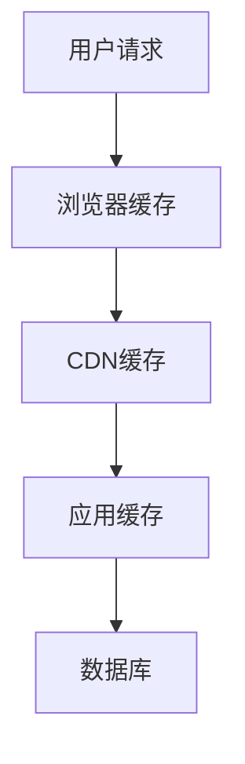
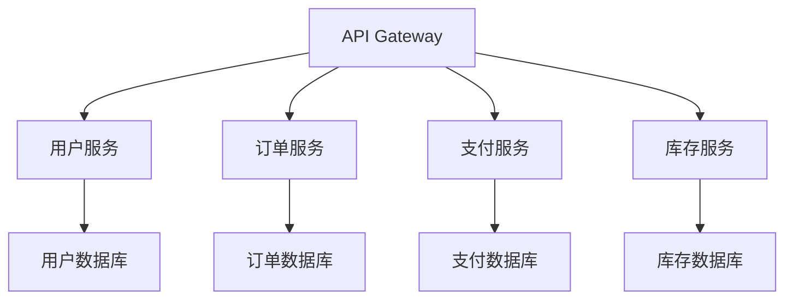

---
# 文章标题（必填）
title: 最佳实践标题

# 页面图标（可选）
icon: /assets/icon/tech.png

# 侧边栏排序（必填）
order: 1

# 作者信息（必填）
author: xiaoxie

# 创建时间（必填）
date: 2024-01-01

# 更新时间（可选）
updateTime: 2024-01-01

# 标签分类（必填，至少一个）
tag:
  - 技术分类
  - 子分类

# 难度等级（可选）
difficulty: advanced

# 阅读时间（可选，分钟）
readingTime: 25

# 是否星标文章（可选）
star: true

# 是否置顶文章（可选）
top: false

# 文章摘要（可选）
summary: 本文档总结了技术名称的最佳实践，包括架构设计、性能优化、安全考虑和实际案例分析。

# 相关文章（可选）
related:
  - 相关技术1
  - 相关技术2
---

# 最佳实践标题

## 概述

> 在这里简要介绍本最佳实践文档的目标和价值

本文档总结了**技术名称**的最佳实践，基于实际项目经验和行业标准，涵盖了：

- 架构设计原则和模式
- 性能优化策略和技巧
- 安全考虑和防护措施
- 实际案例分析和总结

## 架构设计

### 设计原则

#### 原则一：单一职责

**定义**：每个组件只负责一个明确的功能

**优势**：
- 提高代码可维护性
- 降低组件间耦合
- 便于测试和调试

**实现示例**：

```language
// 好的设计：单一职责
class UserService {
    public User getUserById(String id) {
        // 只负责用户查询
    }
}

class EmailService {
    public void sendEmail(String to, String content) {
        // 只负责邮件发送
    }
}
```

#### 原则二：开闭原则

**定义**：对扩展开放，对修改关闭

**实现方式**：
- 使用接口和抽象类
- 采用策略模式
- 依赖注入

**代码示例**：

```language
// 开闭原则实现
interface PaymentStrategy {
    void pay(double amount);
}

class CreditCardPayment implements PaymentStrategy {
    public void pay(double amount) {
        // 信用卡支付实现
    }
}

class PayPalPayment implements PaymentStrategy {
    public void pay(double amount) {
        // PayPal支付实现
    }
}
```

### 设计模式

#### 模式一：工厂模式

**适用场景**：需要根据条件创建不同类型的对象

**实现示例**：

```language
// 工厂模式实现
public class PaymentFactory {
    public static PaymentStrategy createPayment(String type) {
        switch (type) {
            case "credit":
                return new CreditCardPayment();
            case "paypal":
                return new PayPalPayment();
            default:
                throw new IllegalArgumentException("Unknown payment type");
        }
    }
}
```

#### 模式二：观察者模式

**适用场景**：对象间的一对多依赖关系

**实现示例**：

```language
// 观察者模式实现
public interface Observer {
    void update(String message);
}

public class Subject {
    private List<Observer> observers = new ArrayList<>();
    
    public void addObserver(Observer observer) {
        observers.add(observer);
    }
    
    public void notifyObservers(String message) {
        for (Observer observer : observers) {
            observer.update(message);
        }
    }
}
```

## 性能优化

### 1. 数据库优化

#### 索引优化

**策略**：
- 为常用查询字段创建索引
- 避免过多索引影响写入性能
- 定期分析索引使用情况

**示例**：

```sql
-- 创建复合索引
CREATE INDEX idx_user_email_status ON users(email, status);

-- 分析索引使用情况
EXPLAIN SELECT * FROM users WHERE email = 'test@example.com' AND status = 'active';
```

#### 查询优化

**最佳实践**：
- 避免SELECT *
- 使用LIMIT限制结果集
- 合理使用JOIN

**示例**：

```sql
-- 优化前
SELECT * FROM users u 
JOIN orders o ON u.id = o.user_id 
WHERE u.status = 'active';

-- 优化后
SELECT u.id, u.name, o.order_id, o.amount 
FROM users u 
JOIN orders o ON u.id = o.user_id 
WHERE u.status = 'active' 
LIMIT 100;
```

### 2. 缓存策略

#### 缓存层次



#### 缓存实现

```language
// Redis缓存示例
public class CacheService {
    private RedisTemplate<String, Object> redisTemplate;
    
    public Object get(String key) {
        Object value = redisTemplate.opsForValue().get(key);
        if (value == null) {
            value = loadFromDatabase(key);
            redisTemplate.opsForValue().set(key, value, 3600);
        }
        return value;
    }
}
```

### 3. 异步处理

#### 异步任务

```language
// 异步处理示例
@Service
public class AsyncService {
    
    @Async
    public CompletableFuture<String> processAsync(String data) {
        // 异步处理逻辑
        return CompletableFuture.completedFuture("processed: " + data);
    }
}
```

## 安全实践

### 1. 输入验证

#### 数据验证

```language
// 输入验证示例
public class ValidationService {
    
    public boolean validateEmail(String email) {
        String pattern = "^[A-Za-z0-9+_.-]+@(.+)$";
        return email.matches(pattern);
    }
    
    public boolean validateInput(String input) {
        // 防止SQL注入
        return !input.contains("'") && !input.contains(";");
    }
}
```

### 2. 身份认证

#### JWT实现

```language
// JWT认证示例
public class JwtService {
    
    public String generateToken(User user) {
        return Jwts.builder()
            .setSubject(user.getUsername())
            .setIssuedAt(new Date())
            .setExpiration(new Date(System.currentTimeMillis() + 86400000))
            .signWith(SignatureAlgorithm.HS512, secret)
            .compact();
    }
    
    public boolean validateToken(String token) {
        try {
            Jwts.parser().setSigningKey(secret).parseClaimsJws(token);
            return true;
        } catch (Exception e) {
            return false;
        }
    }
}
```

### 3. 数据加密

#### 敏感数据加密

```language
// 数据加密示例
public class EncryptionService {
    
    public String encrypt(String data) {
        // 使用AES加密
        Cipher cipher = Cipher.getInstance("AES");
        cipher.init(Cipher.ENCRYPT_MODE, secretKey);
        byte[] encrypted = cipher.doFinal(data.getBytes());
        return Base64.getEncoder().encodeToString(encrypted);
    }
    
    public String decrypt(String encryptedData) {
        // 解密逻辑
        byte[] decoded = Base64.getDecoder().decode(encryptedData);
        Cipher cipher = Cipher.getInstance("AES");
        cipher.init(Cipher.DECRYPT_MODE, secretKey);
        byte[] decrypted = cipher.doFinal(decoded);
        return new String(decrypted);
    }
}
```

## 实际案例

### 案例一：电商系统优化

**背景**：大型电商系统面临性能瓶颈

**问题分析**：
- 数据库查询缓慢
- 缓存命中率低
- 用户响应时间长

**解决方案**：

1. **数据库优化**
   ```sql
   -- 创建合适的索引
   CREATE INDEX idx_product_category ON products(category_id);
   CREATE INDEX idx_order_user_date ON orders(user_id, created_at);
   ```

2. **缓存策略**
   ```language
   // 多级缓存实现
   public class MultiLevelCache {
       private Map<String, Object> localCache = new ConcurrentHashMap<>();
       private RedisTemplate<String, Object> redisCache;
       
       public Object get(String key) {
           // 先查本地缓存
           Object value = localCache.get(key);
           if (value != null) {
               return value;
           }
           
           // 再查Redis缓存
           value = redisCache.opsForValue().get(key);
           if (value != null) {
               localCache.put(key, value);
               return value;
           }
           
           // 最后查数据库
           value = loadFromDatabase(key);
           if (value != null) {
               redisCache.opsForValue().set(key, value, 3600);
               localCache.put(key, value);
           }
           
           return value;
       }
   }
   ```

3. **异步处理**
   ```language
   // 异步订单处理
   @Async
   public CompletableFuture<Void> processOrder(Order order) {
       // 异步处理订单
       inventoryService.updateStock(order);
       paymentService.processPayment(order);
       notificationService.sendNotification(order);
       return CompletableFuture.completedFuture(null);
   }
   ```

**效果**：
- 响应时间减少60%
- 数据库负载降低40%
- 用户体验显著提升

### 案例二：微服务架构设计

**背景**：单体应用需要拆分为微服务

**架构设计**：



**实现要点**：

1. **服务发现**
   ```yaml
   # 服务注册配置
   spring:
     cloud:
       consul:
         host: localhost
         port: 8500
         discovery:
           service-name: user-service
   ```

2. **负载均衡**
   ```language
   // 负载均衡配置
   @LoadBalanced
   @Bean
   public RestTemplate restTemplate() {
       return new RestTemplate();
   }
   ```

3. **熔断器**
   ```language
   // 熔断器实现
   @HystrixCommand(fallbackMethod = "fallback")
   public String callExternalService() {
       return restTemplate.getForObject("http://external-service/api", String.class);
   }
   
   public String fallback() {
       return "Service unavailable";
   }
   ```

## 总结

通过本文档，我们总结了**技术名称**的最佳实践：

### 关键要点

1. **架构设计**：遵循SOLID原则，合理使用设计模式
2. **性能优化**：多级缓存、异步处理、数据库优化
3. **安全实践**：输入验证、身份认证、数据加密
4. **实际应用**：基于真实案例的解决方案

### 持续改进

- 定期评估和优化
- 关注新技术和趋势
- 收集用户反馈
- 建立监控和告警

## 参考资料

- [官方最佳实践指南](官方指南链接)
- [行业标准文档](标准文档链接)
- [相关技术博客](技术博客链接)

---

**最后更新时间**：2024-01-01  
**作者**：xiaoxie  
**标签**：技术分类, 子分类 