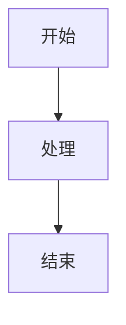

---
# 文章标题（必填）
title: 技术教程标题

# 页面图标（可选）
icon: /assets/icon/tech.png

# 侧边栏排序（必填）
order: 1

# 作者信息（必填）
author: xiaoxie

# 创建时间（必填）
date: 2024-01-01

# 更新时间（可选）
updateTime: 2024-01-01

# 标签分类（必填，至少一个）
tag:
  - 技术分类
  - 子分类

# 难度等级（可选）
difficulty: beginner

# 阅读时间（可选，分钟）
readingTime: 15

# 是否星标文章（可选）
star: true

# 是否置顶文章（可选）
top: false

# 文章摘要（可选）
summary: 本教程将介绍技术概念的基础知识，包括核心概念、实际应用和最佳实践。

# 相关文章（可选）
related:
  - 相关技术1
  - 相关技术2
---

# 技术教程标题

## 概述

> 在这里简要介绍本教程的目标和内容概要

本教程将帮助您掌握**技术名称**的核心概念和实践应用。通过本教程，您将学习到：

- 核心概念和基本原理
- 实际应用场景和案例
- 最佳实践和注意事项
- 进阶学习路径

## 前置知识

在开始本教程之前，建议您具备以下基础知识：

- 基础编程概念
- 相关技术背景
- 开发环境准备

## 核心概念

### 1. 概念一

**概念一**是技术名称的基础组成部分，它负责...

#### 基本语法

```language
// 基本语法示例
code example
```

#### 实际应用

```language
// 实际应用示例
practical example
```

### 2. 概念二

**概念二**在技术名称中起到关键作用...

#### 工作原理



#### 代码实现

```language
// 概念二的实现示例
implementation example
```

## 实践案例

### 案例一：基础应用

**场景描述**：在实际项目中，我们经常需要...

**解决方案**：

```language
// 完整的代码示例
complete code example
```

**关键要点**：
- 要点1：说明
- 要点2：说明
- 要点3：说明

### 案例二：进阶应用

**场景描述**：在复杂场景下，我们需要...

**实现步骤**：

1. **步骤一**：详细说明
   ```language
   // 步骤一代码
   step1 code
   ```

2. **步骤二**：详细说明
   ```language
   // 步骤二代码
   step2 code
   ```

3. **步骤三**：详细说明
   ```language
   // 步骤三代码
   step3 code
   ```

## 最佳实践

### 1. 性能优化

- **建议一**：具体建议和原因
- **建议二**：具体建议和原因
- **建议三**：具体建议和原因

### 2. 错误处理

```language
// 错误处理示例
try {
    // 可能出错的代码
} catch (error) {
    // 错误处理逻辑
}
```

### 3. 安全考虑

- 安全要点1：详细说明
- 安全要点2：详细说明
- 安全要点3：详细说明

## 常见问题

### Q1：常见问题一？

**A1**：详细解答和解决方案

### Q2：常见问题二？

**A2**：详细解答和解决方案

### Q3：常见问题三？

**A3**：详细解答和解决方案

## 总结

通过本教程，您已经学习了：

- 核心概念和基本原理
- 实际应用和最佳实践
- 常见问题的解决方案

## 下一步学习

建议您继续学习以下内容：

1. **进阶主题**：链接到相关文章
2. **实战项目**：链接到项目案例
3. **相关技术**：链接到相关技术

## 参考资料

- [官方文档](官方文档链接)
- [技术博客](技术博客链接)
- [开源项目](开源项目链接)

---

**最后更新时间**：2024-01-01  
**作者**：xiaoxie  
**标签**：技术分类, 子分类 