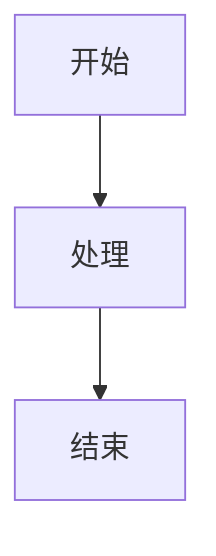

# 技术文档写作规范和内容质量标准

## 概述

本文档定义了VuePress知识库的写作规范和内容质量标准，确保所有技术文档具有一致的结构、风格和质量。

## 写作规范

### 1. 标题规范

#### 文章标题
- 使用简洁明了的标题
- 避免过于技术化的缩写
- 标题长度控制在20字以内
- 使用中文标题，必要时可添加英文副标题

**示例**：
- ✅ 好的标题：`Go语言并发编程指南`
- ❌ 不好的标题：`Golang并发编程指南`

#### 章节标题
- 使用标准的Markdown标题层次（#, ##, ###）
- 标题层次不超过4级
- 标题要准确反映内容

**示例**：
```markdown
# 一级标题
## 二级标题
### 三级标题
#### 四级标题
```

### 2. 内容结构

#### 标准结构
每篇技术文档应包含以下基本结构：

1. **概述**：简要介绍文章目标和内容
2. **前置知识**：学习本文档需要的基础知识
3. **核心内容**：主要技术内容
4. **实践案例**：实际应用示例
5. **最佳实践**：经验和建议
6. **常见问题**：FAQ部分
7. **总结**：内容回顾和下一步学习

#### 内容组织原则
- 从简单到复杂
- 从理论到实践
- 从基础到进阶
- 提供完整的示例

### 3. 代码规范

#### 代码块格式
```markdown
```language
// 代码内容
```
```

#### 代码注释
- 为复杂代码添加注释
- 注释要简洁明了
- 使用中文注释

**示例**：
```go
// 计算斐波那契数列
func fibonacci(n int) int {
    if n <= 1 {
        return n
    }
    return fibonacci(n-1) + fibonacci(n-2)
}
```

#### 代码示例要求
- 代码必须可运行
- 提供完整的上下文
- 包含错误处理
- 添加必要的导入语句

### 4. 图表规范

#### 流程图
使用Mermaid语法：



#### 表格格式
使用标准Markdown表格：

```markdown
| 列1 | 列2 | 列3 |
|-----|-----|-----|
| 内容1 | 内容2 | 内容3 |
```

### 5. 链接规范

#### 内部链接
使用相对路径：
```markdown
[链接文本](../relative/path)
```

#### 外部链接
添加说明和验证：
```markdown
[链接文本](https://example.com) - 外部资源
```

## 内容质量标准

### 1. 技术准确性

#### 要求
- 技术内容必须准确无误
- 代码示例必须可运行
- 版本信息要明确标注
- 及时更新过时内容

#### 检查清单
- [ ] 技术概念解释准确
- [ ] 代码示例可运行
- [ ] 版本信息正确
- [ ] 链接有效

### 2. 内容完整性

#### 要求
- 覆盖主题的核心内容
- 提供完整的上下文
- 包含实际应用场景
- 解答常见问题

#### 检查清单
- [ ] 内容结构完整
- [ ] 示例丰富实用
- [ ] 涵盖常见场景
- [ ] 提供进阶指导

### 3. 可读性

#### 要求
- 语言简洁明了
- 逻辑结构清晰
- 重点内容突出
- 适合目标读者

#### 检查清单
- [ ] 语言表达清晰
- [ ] 逻辑层次分明
- [ ] 重点内容突出
- [ ] 适合读者水平

### 4. 实用性

#### 要求
- 解决实际问题
- 提供可操作的指导
- 包含最佳实践
- 考虑实际应用场景

#### 检查清单
- [ ] 解决实际问题
- [ ] 提供操作指导
- [ ] 包含最佳实践
- [ ] 考虑应用场景

## 质量检查流程

### 1. 自检清单

在提交文档前，请检查以下项目：

#### 内容检查
- [ ] 标题清晰明确
- [ ] 内容结构合理
- [ ] 技术内容准确
- [ ] 示例完整可运行

#### 格式检查
- [ ] 符合写作规范
- [ ] 代码格式正确
- [ ] 图表清晰易懂
- [ ] 链接正确有效

#### 质量检查
- [ ] 拼写和语法正确
- [ ] 术语使用一致
- [ ] 内容逻辑清晰
- [ ] 适合目标读者

### 2. 同行评审

#### 评审要点
- 技术准确性
- 内容完整性
- 可读性和实用性
- 符合写作规范

#### 评审流程
1. 提交文档进行评审
2. 评审人员检查内容
3. 提出修改建议
4. 作者修改完善
5. 最终确认发布

### 3. 持续改进

#### 反馈收集
- 收集读者反馈
- 分析访问数据
- 识别改进机会
- 定期更新内容

#### 更新维护
- 定期检查内容时效性
- 更新过时的技术信息
- 补充新的最佳实践
- 优化内容结构

## 术语和概念

### 技术术语词典

#### 编程概念
- **变量**：存储数据的容器
- **函数**：可重用的代码块
- **类**：面向对象编程的基本单位
- **接口**：定义方法签名的抽象类型
- **模块**：代码的组织单位

#### 架构概念
- **微服务**：小型、独立的服务
- **分布式**：跨多个节点的系统
- **高可用**：高可用性系统
- **负载均衡**：分发请求的机制
- **容错**：系统故障时的恢复能力

#### 开发概念
- **API**：应用程序编程接口
- **SDK**：软件开发工具包
- **IDE**：集成开发环境
- **CLI**：命令行界面
- **GUI**：图形用户界面

### 概念定义标准

#### 定义格式
```markdown
**概念名称**：概念的准确定义

**特点**：
- 特点1
- 特点2
- 特点3

**应用场景**：
- 场景1
- 场景2
```

#### 示例
```markdown
**微服务**：一种将应用程序构建为一组小型自治服务的架构风格

**特点**：
- 服务独立部署
- 技术栈灵活
- 故障隔离

**应用场景**：
- 大型复杂系统
- 需要快速迭代
- 团队独立开发
```

## 更新记录

- 2024-01-01：创建写作规范
- 2024-01-01：添加质量检查流程
- 2024-01-01：完善术语词典 